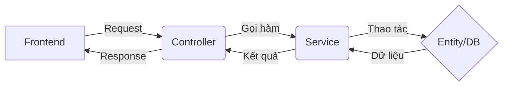

# Hướng dẫn Phát triển API & Cấu trúc Module (NestJS)

Tài liệu này dành cho các thành viên trong Team để nắm bắt luồng hoạt động và quy chuẩn viết code trong dự án DALTA.

---

## 1. Cấu trúc Thư mục (Rã Module)
Dự án backend được tổ chức theo nhiều NestJS application/service. Mỗi service có source root riêng, không tạo module mới vào `src/` chung nữa.

**Ví dụ cấu trúc chuẩn:**
```text
backend/
├── src-auth-users/     # Auth + Users Service
├── src-products/       # Products + Brands Service
├── src-categories/     # Categories Service
├── src-cart/           # Cart Service
├── src-orders/         # Orders Service
├── src-gateway/        # API Gateway
├── src-payments/       # Payments Service
├── src-notifications/  # Notifications Service
└── nest-cli.json       # Khai báo các Nest application trong monorepo
```

Khi thêm tính năng mới, hãy đặt nó vào service sở hữu nghiệp vụ đó. Ví dụ tính năng liên quan giỏ hàng đặt trong `src-cart/src/cart`, còn tính năng liên quan đơn hàng đặt trong `src-orders/src/orders`.

---

## 2. Luồng hoạt động của một yêu cầu API



---

## 3. Quy trình 4 Bước để viết một API mới

### Bước 1: Tạo Module & Đăng ký
Sử dụng lệnh theo service tương ứng hoặc tạo thủ công trong đúng source root. Module phải được khai báo trong `imports` của `AppModule` của service đó.

### Bước 2: Định nghĩa Entity (Database)
Tạo file trong thư mục `entities/`. Đây là nơi bạn thiết kế bảng. 
*Lưu ý: Luôn dùng Decorator `@Entity()`, `@Column()`.*

### Bước 3: Viết Service (Logic)
Sử dụng lệnh: `nest g s <tên_module>`.
*Mọi tính toán, gọi DB, xử lý dữ liệu phải nằm ở đây.*

### Bước 4: Viết Controller (Entry Point)
Sử dụng lệnh: `nest g co <tên_module>`.
*Chỉ làm nhiệm vụ nhận yêu cầu và trả kết quả. Dùng các Decorator `@Get()`, `@Post()`, `@Body()`, `@Param()`...*

---

## 4. Quy tắc làm việc Team (Lưu ý quan trọng)

1.  **Không dùng `any`:** Hãy định nghĩa kiểu dữ liệu rõ ràng.
2.  **Bảo mật:** Các API nhạy cảm (Xóa, Sửa, Tạo) phải được bảo vệ bởi `@UseGuards(JwtAuthGuard)`.
3.  **Lỗi (Exception):** Sử dụng các lỗi có sẵn của NestJS như `NotFoundException`, `BadRequestException` để trả về cho người dùng.
4.  **Comment:** Viết comment tiếng Việt cho các logic nghiệp vụ phức tạp để anh em khác dễ đọc.

---
*Chúc cả team hoàn thành tốt nhiệm vụ!*
